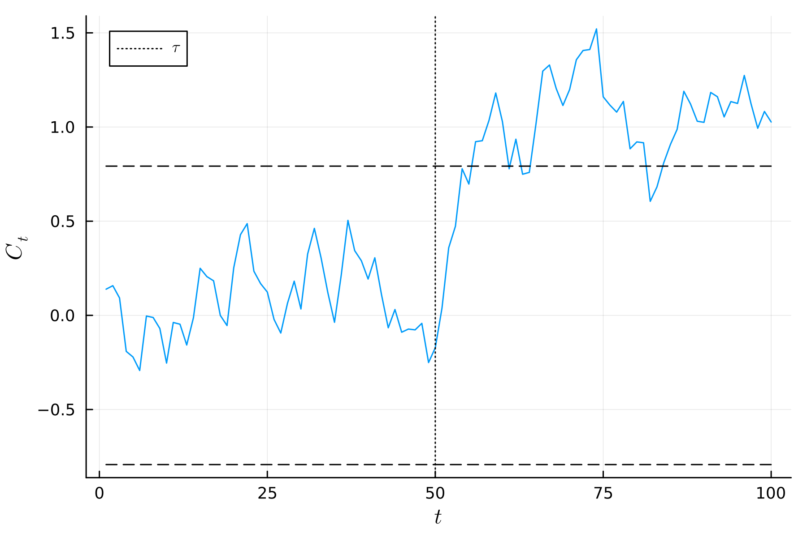

# Residual-Based Monitoring of Autocorrelated Data

In this section, we demonstrate how the `ResidualStatistic` and `AbstractPhase2` interfaces can be extended to accommodate custom data types. Specifically, we focus on monitoring the residuals of an autoregressive $\text{AR}(1)$ model [shumway2017](@citep),
$$
  y\_t = \phi y\_{t-1} + \varepsilon\_{t}, \quad \varepsilon\_{t} \sim N(0,1),
$$
using an EWMA control chart.

First, the required packages are imported,

```julia
using StatisticalProcessMonitoring, Distributions, Random, NLopt, Plots, Parameters, LaTeXStrings
```

We then define a specialization of the `ResidualStatistic` type, which will be used to apply the control chart to the $\text{AR}(1)$ residuals.

```julia
julia> import StatisticalProcessMonitoring.residual!,
          StatisticalProcessMonitoring.new_data!
julia> mutable struct AR1Statistic{S} <: ResidualStatistic
           stat::S
           phi::Float64
           ym1::Float64
       end

julia> function residual!(x, S::AR1Statistic)
           yhat = x - S.phi * S.ym1   
           S.ym1 = x
           return yhat
       end
```

To sample observations from an $\text{AR}(1)$ process, we define a new type called `Phase2AR1`.

```julia
julia> @with_kw mutable struct Phase2AR1 <: 
          StatisticalProcessMonitoring.AbstractPhase2
          phi::Float64
          y::Float64 = 0.0
          init::Bool = false
       end
```

The initial observation $y_0$ required to sample $y_1$ is initialized using the stationary distribution $N(0, 1 / (1 + \phi^2 ))$.

```julia
julia> function new_data!(PH2::Phase2AR1)
           if !PH2.init
               PH2.y = randn() / sqrt(1 - PH2.phi^2)
               PH2.init = true
           end
           yhat = PH2.phi * PH2.y + randn()
           PH2.y = yhat
           return yhat
       end
```

We consider an $\text{AR}(1)$ model with $\phi = 0.5$.

```julia
julia> seed = 4398354798
julia> Random.seed!(seed)
julia> phi = 0.5
julia> PH2 = Phase2AR1(phi = phi)
```

We define an EWMA control chart applied to the residuals of the $\text{AR}(1)$ model using the `AR1Statistic` object.

```julia
julia> STAT = AR1Statistic(EWMA(λ = 0.1), phi, 0.0)
```

We use a two-sided control limit for the control chart.

```julia
julia> LIM = TwoSidedFixedLimit(1.0)
```

We set the ARLIC to 500 and create the `ControlChart` object.

```julia
julia> NOM = ARL(500)
julia> CH = ControlChart(STAT, LIM, NOM, PH2)
```

The smoothing constant of the EWMA control chart is optimized against an anticipated persistent mean shift of $\delta = 2$.

```julia
julia> delta = 2.0
julia> rlsim_oc = x -> run_sim_oc(x, shift = delta)
julia> settings = OptSettings(verbose = false, minpar = [0.001],
                               maxpar = [0.99])
julia> opt = optimize_design!(CH, rlsim_oc, settings, optimizer = :LN_BOBYQA)
julia> print(opt)
1-element Vector{Float64}:
 0.13830568163003895
```

We consider 100 Phase II observations from the $\text{AR}(1)$ process with $\phi = 0.5$.

```julia
julia> n = 100
julia> tau = 50
julia> DGP = Phase2AR1(phi = phi)
julia> y = [new_data!(DGP) for _ in 1:n]
julia> y[(tau+1):n] .+= delta
```

The control chart is then applied to the data and the results are plotted.

```julia
julia> proc = apply_chart(CH, y)
julia> plt = plot_series(proc, dpi = 300, label = "", xlab = L"t",
                         ylab = L"C_t")
julia> vline!(plt, [tau], label = "tau", linestyle = :dot, colour = "black")
```


