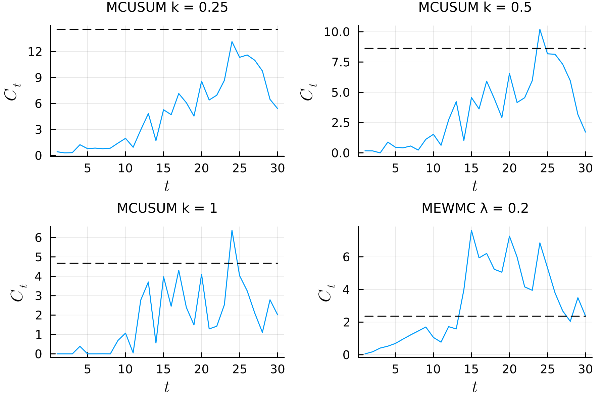

## Jointly Monitoring the Mean and Covariance Using a Multi-Chart Scheme

Here, we provide an example of multiple control charts being run simultaneously. We consider sequential monitoring of the data from Example 7.7 of [qiu2013](@citet).

First, the required packages are loaded
```julia
using StatisticalProcessMonitoring, LinearAlgebra, Random, Distributions, CSV, DataFrames, Plots
```

In the example, three quality variables resulting from a production process are monitored for changes. Under IC conditions, the quality variables follow the $N_3(\bm{0}, \Sigma_0)$ distribution, where
$$
  \Sigma_0 = \begin{pmatrix}
    1.0  & 0.8 & 0.5\\
    0.8 & 1.0 & 0.8 \\
    0.5 & 0.8 & 1.0
  \end{pmatrix}.
$$

First, we set the seed for replicability.

```julia
julia> seed = 54397858713
julia> Random.seed!(seed)
```

Then, we initialize the distribution of the observations under IC conditions.

```julia
julia> μ = [0, 0, 0]
julia> Σ = [1.0 0.8 0.5; 0.8 1.0 0.8; 0.5 0.8 1.0]
julia> DIST = MultivariateNormal(μ, Σ)
```

Next, we define three CUSUM charts with allowance constants of 0.25, 0.5, and 1, respectively. Additionally, we define a MEWMC control chart with a smoothing constant of 0.2.

```julia
julia> p = length(μ)
julia> STATS = (MCUSUM(k = 0.25, p = p), MCUSUM(k = 0.5, p = p),
                MCUSUM(k = 1.0, p = p), MEWMC(λ = 0.2, p = p))
```

To account for the mean and covariance of the distribution, the four control charts are applied to the standardized observations,
$$
  \bm{Z}_t = \Sigma_0^{-1 / 2}\bm{X}_t.
$$

We use the type `LocationScaleStatistic` to standardize observations in location-scale families.

```julia
julia> Σ_sqm1 = inv(sqrt(Σ))
julia> EST_STATS = Tuple(LocationScaleStatistic(s, μ, Σ_sqm1) for s in STATS)
```

Control charts will signal an alarm whenever their values cross their respective upper control limits $\text{UCL}_j$.

```julia
julia> LIMS = Tuple(OneSidedFixedLimit(1.0, true) for _ in 1:4)
```

To find appropriate control limits, we set the nominal median run length to 200.

```julia
julia> NM = QRL(200, 0.5)
```

We generate Phase II observations from the IC process distribution.

```julia
julia> PH2 = Phase2Distribution(DIST)
```

Then, we create the `ControlChart` object and find the control limits.

```julia
julia> CH = ControlChart(EST_STATS, LIMS, NM, PH2)
julia> h = bootstrapCL!(CH)
julia> print(h)
(h = [14.568353665174286, 8.627690357206408, 4.677555568948659,
    2.360499495019121], iter = 8, status = "Convergence")
```

We then load the Phase II data (available at this [Zenodo](https://zenodo.org/records/10683050) link) and plot the results.

```julia
julia> data = CSV.read("example77.csv", DataFrame)
julia> xnew = Matrix(data)[:, 1:3]
julia> proc = apply_chart(CH, xnew)
julia> plt = plot_series(proc, dpi = 300, label = "", xlab = L"t",
                          ylab = L"C_t", subtitles = ["MCUSUM k = 0.25", "MCUSUM k = 0.5",
                          "MCUSUM k = 1", "MEWMC λ = 0.2"])
```


