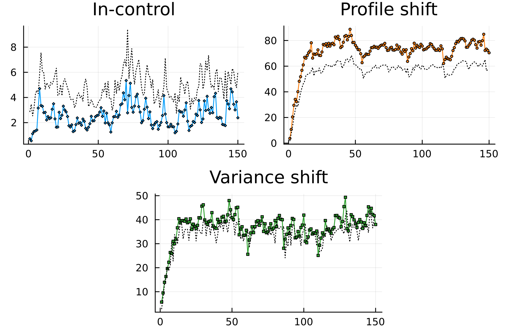

# Monitoring nonparametric profiles

```julia
using StatisticalProcessMonitoring, Distributions, Random, Loess, Plots, LaTeXStrings
```

```julia
Random.seed!(41289355)
n = 500
nj = 20
x_grid = collect(0.5:0.5:10)
xs = Matrix{Float64}(undef, n, nj)
for i in 1:n
    xs[i, :] = x_grid
end
ys = sin.(xs) .+ randn(n, nj)
g = loess(vec(xs), vec(ys), span=0.3)
plt = plot(minimum(xs):0.01:maximum(xs), (x) -> predict(g, x), linewidth=1.75, label=L"\hat{f}(x)", dpi=300)
scatter!(plt, vec(xs), vec(ys), markersize=1, label="", colour="black")
```


```julia
dat = FunctionalData(xs, ys)
STAT = NEWMA(0.2, g, dat)
LIM = OneSidedBootstrapLimit(STAT, true, 1000)
NM = ARL(500)
PH2 = Phase2(Bootstrap(), dat)
CH = ControlChart(STAT, LIM, NM, PH2)

n2 = 150
xs_oc = xs[1:n2, :]
ys_ic = sin.(xs_oc) .+ randn(n2, nj)
ys_oc = sin.(xs_oc) + 2*cos.(xs_oc) .+ randn(n2, nj)
ys_oc2 = sin.(xs_oc) .+ 2*randn(n2, nj)
dat_ic = FunctionalData(xs_oc, ys_ic)
dat_oc = FunctionalData(xs_oc, ys_oc)
dat_oc2 = FunctionalData(xs_oc, ys_oc2)

proc_ic = apply_chart(CH, dat_ic)
proc_oc = apply_chart(CH, dat_oc)
proc_oc2 = apply_chart(CH, dat_oc2)
```

```julia
markersize=1.5
plt1 = plot_series(proc_ic, marker=:d, title="In-control", l_linestyle=:dot, markersize=markersize, dpi = 300, label="")
plt2 = plot_series(proc_oc, marker=:o, title="Profile shift",l_linestyle=:dot,  markersize=markersize, dpi = 300, colour = palette(:tab10)[2], label="")
plt3 = plot_series(proc_oc2, marker=:square, title="Variance shift", l_linestyle=:dot, markersize=markersize, dpi = 300, colour = palette(:tab10)[3], label="")
l = @layout [grid(1,2); _{0.2w} c{0.55w} _{0.25w}]
plt = plot(plt1,plt2,plot(frame=:none), plt3; layout = l)
```


