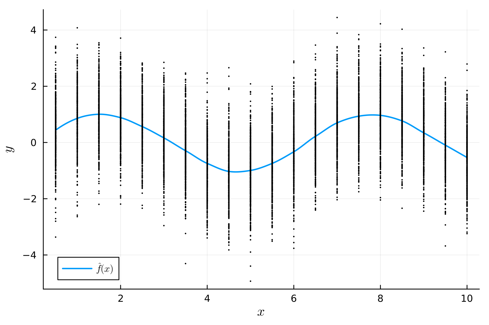

## Detecting Changes in Profiles

Here, we demonstrate how the `Phase2` type can be used to also work with structured data types. In this example, we consider monitoring profiles:

$$
  Y_{tj} = f(x_{tj}) + \varepsilon_{ij}, \quad j = 1, 2, \ldots, n_t,
$$

where $f(x_{tj})$ is the unknown function relating $x_{tj}$ to $Y_{tj}$, $\varepsilon_{ij} \sim F_\varepsilon$, $\mathbb{E}[\varepsilon_{ij}] = 0$, and $\mathbb{V}[\varepsilon_{ij}] = \sigma > 0$ for all $t$ and $j$.

Let's load the required packages,

```julia
using StatisticalProcessMonitoring, Distributions, Random, Loess, Plots, LaTeXStrings
```

For simplicity, we assume equi-spaced $\bm{x_t}$ in [0.5, 10] with increments of 0.5 for all $t = -m+1, \ldots, 0, 1, 2, \ldots$.

```julia
julia> n = 500
julia> nj = 20
julia> x_grid = collect(0.5:0.5:10)
julia> xs = Matrix{Float64}(undef, n, nj)
julia> for i in 1:n; xs[i, :] = x_grid; end
```

We generate an initial sample of 500 IC profiles from the functional process using the standard normal distribution for $F_\varepsilon$.

```julia
julia> Random.seed!(41289355)
julia> ys = sin.(xs) .+ randn(n, nj)
```

We use the `FunctionalObservation` type to represent profile data. The package provides an alias for representing functional data as a collection of functional observations.

```julia
const FunctionalData{A,B} = Vector{FunctionalObservation{A,B}} where {A,B}
```

We create a Phase II object for simulating run lengths for a functional control chart.

```julia
julia> dat = FunctionalData(xs, ys)
julia> PH2 = Phase2(Bootstrap(), dat)
```

We use the nonparametric exponentially weighted moving average (NEWMA) control chart. The IC profile $\widehat{f}$ is estimated using the LOESS estimator.

```julia
julia> using Loess
julia> g = loess(vec(xs), vec(ys), span = 0.3)
julia> plt = plot(minimum(xs):0.01:maximum(xs), (x) -> predict(g, x),
                  linewidth = 1.75, label = L"\hat{f}(x)", xlab = L"x", ylab = L"y",
                  dpi = 300)
julia> scatter!(plt, vec(xs), vec(ys), markersize = 1, label = "",
                colour = "black")
```



We define a NEWMA chart with smoothing parameter $\lambda = 0.2$.

```julia
julia> STAT = NEWMA(0.2, g, dat)
```

We use an upper decision interval with constant false-alarm rate and sequential estimation using 1000 bootstrap simulations.

```julia
julia> LIM = OneSidedBootstrapLimit(STAT, true, 1000)
```

We set the nominal in-control average run length to 500.

```julia
julia> NM = ARL(500)
julia> CH = ControlChart(STAT, LIM, NM, PH2)
```

The NEWMA control chart is then applied to three sequences of Phase II data:

```julia
julia> n2 = 150
julia> xs_oc = xs[1:n2, :]
julia> ys_ic = sin.(xs_oc) .+ randn(n2, nj)                  # In-control
julia> ys_oc = sin.(xs_oc) + 2*cos.(xs_oc) .+ randn(n2, nj)  # Profile shift
julia> ys_oc2 = sin.(xs_oc) .+ 2*randn(n2, nj)               # Variance shift
```


The matrices containing the Phase II observations are converted to `FunctionalData` objects, which enables application of the control chart.

```julia
julia> dat_ic = FunctionalData(xs_oc, ys_ic)
julia> dat_oc = FunctionalData(xs_oc, ys_oc)
julia> dat_oc2 = FunctionalData(xs_oc, ys_oc2)
```

Once the `FunctionalData` objects are created, the control chart can be run on the three data sequences.

```julia
julia> proc_ic = apply_chart(CH, dat_ic)
julia> proc_oc = apply_chart(CH, dat_oc)
julia> proc_oc2 = apply_chart(CH, dat_oc2)
```


The results of applying the NEWMA control chart to the Phase II sequences are shown in Figure 1. The plots display the values of the NEWMA control chart for the three cases, with the control limits estimated and shown as a black dashed line. The control chart effectively detects changes in both the profile shift and variance shift. When the process is in control (IC), no change is detected by the control chart.

```julia
markersize = 1.5
plt1 = plot_series(proc_ic, marker = :d, title = "In-control", l_linestyle = :dot,
                    markersize = markersize, dpi = 300, label = "", xlab = L"t", ylab = L"C_t")
plt2 = plot_series(proc_oc, marker = :o, title = "Profile shift",l_linestyle = :dot,
                    markersize = markersize, dpi = 300, colour = palette(:tab10)[2],
                    label = "", xlab = L"t", ylab = L"C_t")
plt3 = plot_series(proc_oc2, marker = :square, title = "Variance shift", l_linestyle = :dot,
                    markersize = markersize, dpi = 300, colour = palette(:tab10)[3],
                    label = "", xlab = L"t", ylab = L"C_t")
l = @layout [grid(1,2); _{0.2w} c{0.55w} _{0.25w}]
plt = plot(plt1,plt2,plot(frame = :none), plt3; layout = l)
```

